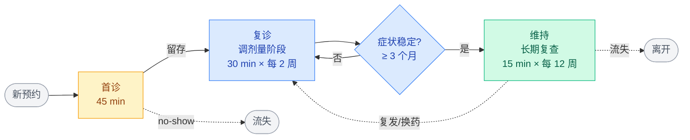
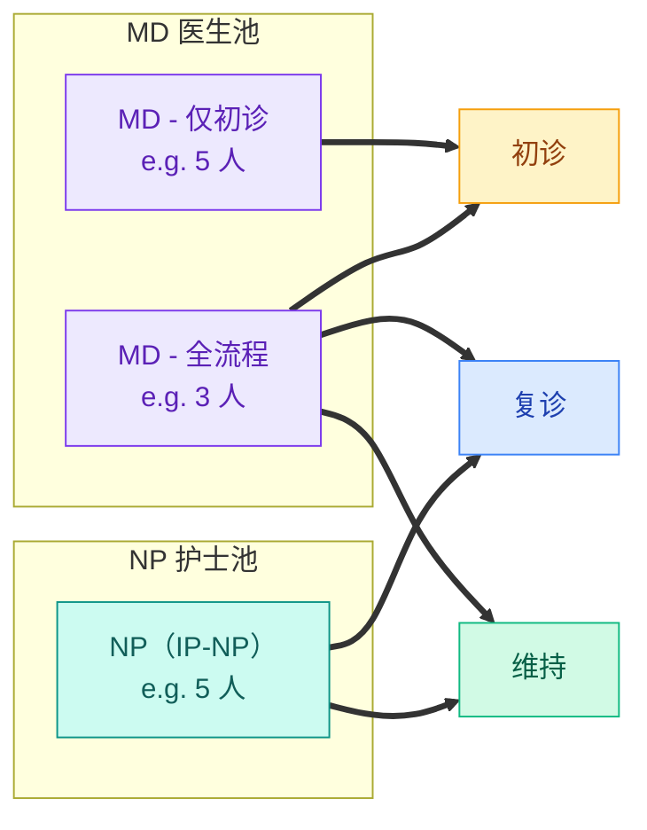
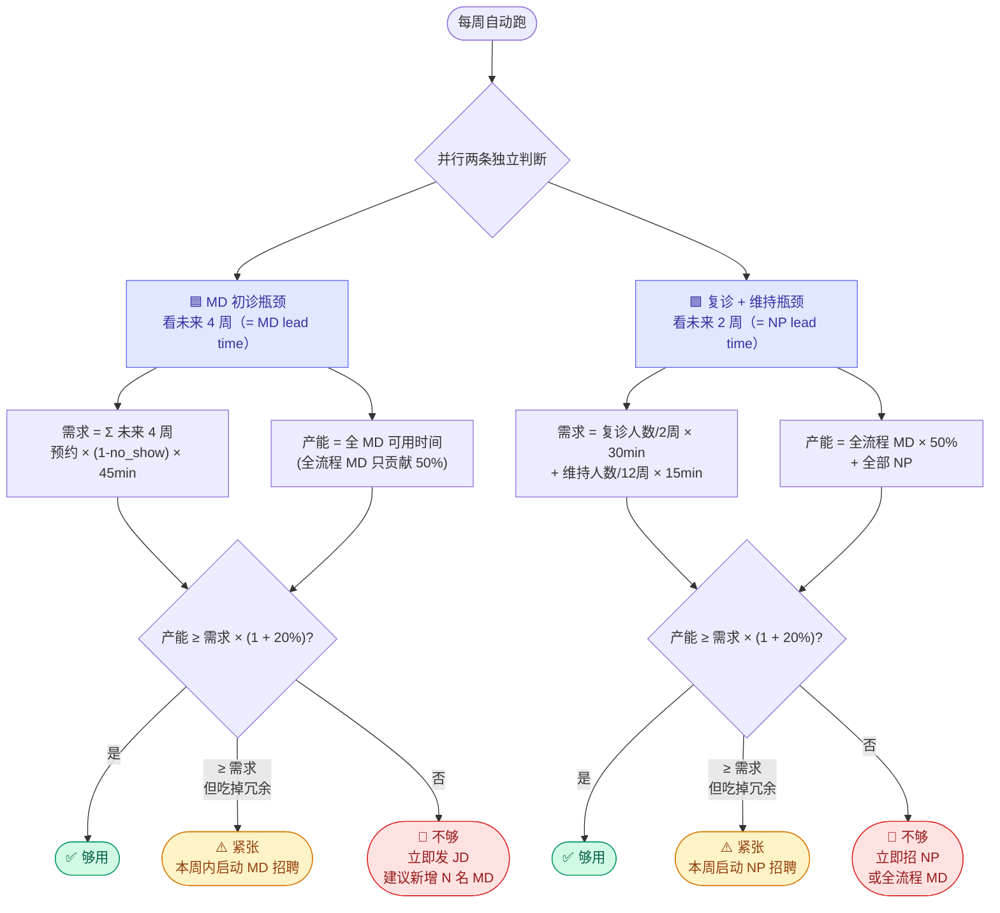

# 供需 / 招聘模型流程图

> 三张图：① 病人临床流程 ② 角色与任务匹配 ③ 招聘判断逻辑。
> GitHub、VSCode、Notion 都能直接渲染 Mermaid 代码块。

---

## ① 病人临床流程

患者从新预约到长期维持的全路径，以及每个阶段由谁负责。

**关键点**
- 三阶段单向推进，但维持期可回流到复诊（复发 / 换药）
- 流失节点 = 模型里的 churn，v0 暂未单独建模
- 时长是模型常数，存在 `data/constants.json` → `appointmentMinutes`

---

## ② 角色与任务匹配

谁能干什么活——决定产能怎么分配。

**关键约束**
- **初诊只能 MD**（NP 无诊断权）
- **全流程 MD 是双面手**：他们的时间按 `constants.fullFlowMdSplit` 拆给初诊 / 非初诊两边（v0 默认 50/50）
- **NP 必须是 IP-NP**（独立处方权）才能开 ADHD 兴奋剂（Schedule 2 受控药）

---

## ③ 招聘判断逻辑

模型每次跑出来回答两个问题：**MD 初诊够不够？复诊+维持够不够？**

**为什么是"两条独立判断"而不是"一个总判断"**
- 招的人不一样：MD 紧张 → 招 MD；非初诊紧张 → 招 NP（成本更低）
- 反应时间不一样：MD lead time 4 周 vs NP 2 周
- 看的窗口也不一样：分别匹配各自的 lead time，刚好"今天发 JD，人到岗时缺口正好被填上"

**冗余 (20%) 的意义**
- 不是为了过度保守，是给"招聘 + onboarding 期间需求继续增长"留缓冲
- 一旦 capacity 跌破 `需求 × 1.2`，说明缓冲在吃了，再不动手就来不及

---

## 数据流速查

| 图上的"X" | 在代码里叫什么 | 在数据里写在哪 |
|----------|---------------|---------------|
| 未来 4 周预约 | `demand.newInitialBookings` | `data/demand.json` |
| no-show 率 | `demand.noShowRate` | `data/demand.json` |
| MD 列表 + 是否全流程 | `staff.md[].subtype` | `data/staff.json` |
| NP 列表 | `staff.np[]` | `data/staff.json` |
| 复诊 / 维持在册人数 | `patients.inFollowup` / `inMaintenance` | `data/patients.json` |
| 历史 23 周快照 | `history.weekly[]` | `data/history.json` |
| 诊次时长 / 冗余 / Lead time | `constants.*` | `data/constants.json` |
| 全流程 MD 时间分配 | `constants.fullFlowMdSplit` | `data/constants.json` |

模型算法本身在 `lib/model.ts`，三个核心函数：
- `mdInitialCapacityMinPerWeek(staff, c)` — MD 初诊产能
- `nonInitialCapacityMinPerWeek(md, np, c)` — 复诊+维持产能
- `computeDecision(data)` — 串起来出招聘判断
